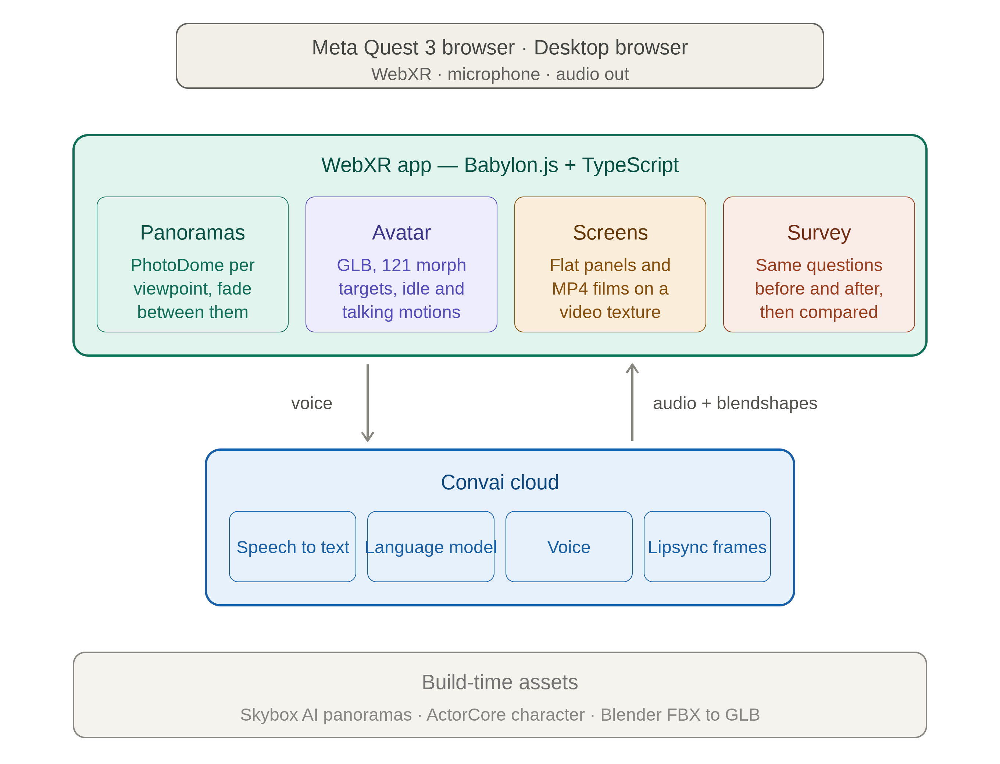

# Branch Closure Confidence Navigator

A WebXR proof of value: a virtual banking hub that helps customers whose local
branch is closing understand what happens next, and measures whether it
actually made them feel better about it.

---

## Contents

- [The problem](#the-problem)
- [What this is](#what-this-is)
- [For business readers](#for-business-readers)
- [For technical readers](#for-technical-readers)
- [Running it](#running-it)
- [Third-party services](#third-party-services)
- [Constraints and limitations](#constraints-and-limitations)
- [Open questions](#open-questions)

---

## The problem

When a bank closes a branch, the customers most affected are the ones least
equipped to absorb the change: older customers, those in rural areas, people
who rely on cash, and anyone with low digital confidence.

A letter explaining that services are "still available" does not answer the
questions those customers actually have. Where do I go? Will I have to travel
further? Can I still pay in a cheque? Will there be a person to talk to?

Telling someone their options is not the same as showing them.

---

## What this is

A virtual banking hub the customer walks into, wearing a headset or on a
laptop. A relationship manager greets them by name, shows them around, and
answers whatever they ask — in their own words, out loud.

Along the way she can play a short demonstration on screen: how to deposit a
cheque from a phone, or a tour of the mobile app.

The same five questions are asked before they go in and again at the end. The
difference between those two sets of answers is the evidence.

### The journey

| Step | What happens |
|---|---|
| Street | Photo of the shopfront. Baseline survey, four questions. |
| Entry | Avatar greets the customer, offers a tour of the hub. |
| Q&A | Open conversation. She answers from a curated knowledge base. |
| Demonstration | On request, a film plays on a screen beside her. |
| Counter | Cheque deposits and everyday account servicing. |
| Private room | Where longer conversations would happen. |
| Close | The five questions again, then a before-and-after panel. |

---

## For business readers

### What it demonstrates

**That reassurance can be shown rather than stated.** The customer stands in
the space, sees the counter, and is walked through the alternative — instead of
reading about it.

**That the conversation can be genuinely open.** She is not a decision tree.
The customer asks whatever is actually worrying them, in their own words, and
gets an answer grounded in the material the bank supplied.

**That the effect is measurable.** Pre and post answers on the same five
questions give a number, not an anecdote. The closing panel shows the shift.

### What it does not do

It holds no customer data, connects to no banking systems, and performs no
transactions. The customer in the demonstration is fictional and the details
are fixed in configuration.

It is a proof of value: evidence that the approach works, not a product.

### What it costs to run

Roughly £60–100 a month in third-party services during development — an AI
panorama generator, the conversational AI, and a character licence. Two of
those were one-off purchases. Nothing requires new infrastructure.

### The measurement

Five questions, asked twice:

1. How concerned do you feel about your local branch closing? *(0–10)*
2. How confident are you that you know where to go after it closes? *(0–10)*
3. How confident are you using mobile banking for simple tasks? *(0–10)*
4. Do you understand which services are available at a Banking Hub, Post
   Office, or through mobile banking? *(Yes / Partly / No / I need more help)*
5. Would you still like help from a colleague? *(end only)*

Identical wording both times, so the answers are comparable. The three scale
questions are what the closing panel reports.

---

## For technical readers

### Stack

| Layer | Choice | Why |
|---|---|---|
| Renderer | Babylon.js | Mature WebXR support, good glTF handling |
| Language | TypeScript | |
| Build | Vite | |
| Environment | 360 equirectangular panoramas on a PhotoDome | Photoreal without modelling a room |
| Avatar | ActorCore GLB, ARKit blendshapes | 121 morph targets including the ARKit 52 |
| Conversation | Convai Web SDK | Speech in, LLM, speech out, and a blendshape stream for lipsync |
| Target | Meta Quest 3 browser, plus desktop | |

### Architecture



### How the world is built

The hub is not modelled geometry. Each viewpoint is a single panorama mapped
onto a sphere, with the viewer at the centre.

```
rig      follows the head every frame
 └ world carries the recentre rotation
    ├ dome        the panorama sphere
    ├ markers     teleport targets
    ├ avatar      the relationship manager
    ├ panels      flat photo screens
    └ survey      question cards
```

Everything hangs off `world`, so a recentre rotates the panorama and its
markers together and they cannot drift apart.

Moving between viewpoints swaps the dome's texture behind a short fade. Nothing
is stitched. During the fade the dome also slides a couple of metres past the
viewer, which reads as a step forward rather than a cut.

The dome is deliberately small — 20m diameter rather than 1000m. At a huge
radius stereo disparity approaches zero and the brain reads the room as
enormous. Shrinking it gives a plausible convergence distance.

### Lipsync

Convai streams `Float32Array(61)` frames at roughly 60fps. The render loop
drains the queue and applies them to the character's morph targets.

The character names its ARKit shapes `A25_Jaw_Open`; Convai sends `jawOpen`.
Both normalise to `jawopen` by stripping the index prefix, removing
underscores and lowercasing — so no hand-written mapping table is needed.

```ts
const normalise = (name: string) =>
  name.replace(/^[AT]\d+_/, "").replace(/_/g, "").toLowerCase();
```

### Demonstration films

Her replies are watched for cue phrases defined in the knowledge base. When one
appears, the app waits for her to stop speaking, dims the hub, and plays the
matching film on a plane in front of the viewer.

An iframe cannot render inside an immersive WebXR session, so YouTube and
similar embeds are not an option. A `<video>` element can become a texture,
which is why the films are local MP4s.

She is muted and interrupted when a film starts — she has no way of knowing one
is playing, and would otherwise talk over it.

### Project layout

```
src/
├── main.ts      scene, nodes, avatar, panels, video, Convai
└── survey.ts    pre/post survey and results panel

public/
├── panoramas/   4096×2048 JPEG, one per viewpoint
├── images/      flat photos for the panels
├── avatars/     the character GLB
└── video/       demonstration films
```

### Configuration

Almost everything is in named blocks at the top of `main.ts`:

- `NODES` — panoramas and the hotspots in each
- `PANELS` — flat photo screens
- `AVATAR` — position, scale, facing
- `VIDEOS` and `VIDEO_CUES` — films and the phrases that trigger them
- `DOME_SIZE`, `FADE_MS`, `DOLLY_METRES` — feel

Survey questions live in `SURVEY` at the top of `survey.ts`.

### Asset pipeline

Characters come from ActorCore as FBX and are converted with headless Blender:

```bash
blender --background --python merge.py -- character.fbx idle.fbx talk.fbx out.glb
```

Two settings matter and are easy to lose:

- `export_morph=True` — without it the blendshapes are silently dropped
- `export_animation_mode='NLA_TRACKS'` — without it only one motion survives

Do not run `gltf-transform optimize` on the character. It merges meshes and
destroys the morph targets. Use `resize` if the file needs shrinking.

---

## Running it

```bash
npm install
npm run dev
```

Create `.env` in the project root:

```
VITE_CONVAI_API_KEY=...
VITE_CONVAI_CHARACTER_ID=...
```

### On a Quest

```bash
adb devices
adb reverse tcp:5173 tcp:5173
npm run dev
```

Then `http://localhost:5173` in the Quest browser.

**Grant the microphone on the street panel, before entering VR.** Permission
prompts cannot be shown inside an immersive session.

### Keyboard shortcuts

| Key | Does |
|---|---|
| `1` / `2` | Run the baseline / closing survey |
| `v` / `b` | Play the cheque / app film |
| `[` `]` | Rotate the world |
| `-` `=` | Field of view |
| `p` | Print the yaw you are facing — used to place markers |

### Controller

| Button | Does |
|---|---|
| Trigger | Jump to the marker you are pointing at |
| B / Y | Go back |
| A / X | Recentre |
| Squeeze | Cheque film |
| Thumbstick press | App film |
| Thumbstick L/R | Rotate the world |

---

## Third-party services

| Service | Used for | Data leaving the browser |
|---|---|---|
| Convai | Speech recognition, conversation, speech synthesis, lipsync | Customer audio and transcripts |
| Skybox AI | Generating the panoramas | Text prompts only, at build time |
| ActorCore | The character model | None at runtime |

**The Convai row needs sign-off.** Live customer audio is processed on their
servers. That is a conversation to have before this is shown to anyone outside
the project team, not after.

---

## Constraints and limitations

**No live data.** No authentication, no transactions, no account information.
The demonstration customer is fictional.

**Brand-neutral signage.** No approved logos are used.

**You teleport, you do not walk.** A panorama is a painted sphere; there is no
parallax within a viewpoint. Movement is between fixed positions. This is true
of every 360 tour and is fine for the purpose, but say it before someone
discovers it in the headset.

**The panoramas are generated, not photographed.** They depict a plausible
banking hub, not a specific branch.

**The character is good, not photoreal.** ActorCore models ship with a single
merged material, so the eyes and teeth cannot have their own shading. At
conversational distance it holds up; under close inspection it does not.

**Answers are logged to the console.** Nothing is persisted. Adding storage is
straightforward but has not been done, deliberately — nothing to secure while
this is a proof of value.

---

## Open questions

- Sign-off on customer audio being processed by a third party
- Whether the demonstration films are licensed for this use
- Whether the survey results should persist, and if so, where
- Whether two more viewpoints (waiting area, forms wall) are worth generating
